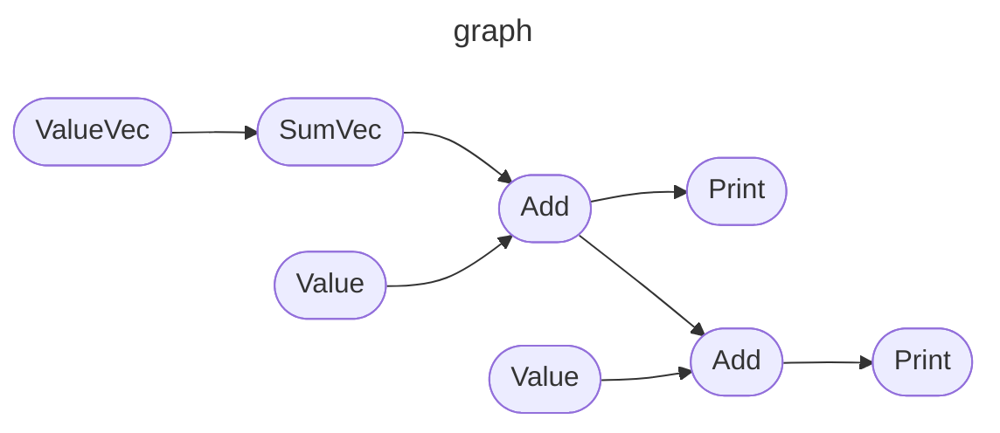

_This is just a nice picture._

# GNode

A generic node-based data structure for node graph programming in C++.

## License

This project is licensed under the GNU General Public License v3.0.

## Getting started

### Building

Build by making a build directory (i.e. `build/`), run `cmake` in that dir, and then use `make` to build the desired target.

``` bash
mkdir build && cd build
cmake ..
make
```

To get the documentation:
```
cd build
make doc_gnode
[YOUR_WEB_BROWSER] doc/doc_doxygen/html/index.html
```

### Usage examples

Examples are available in the examples folder, featuring a calculator that includes both float and 2D vector of floats data types:


